# LuxeCart - Smart Retail System

LuxeCart is an advanced, AI-powered e-commerce platform that integrates a full-featured customer frontend, an administrative dashboard, and a cutting-edge Retrieval-Augmented Generation (RAG) chatbot capable of domain-specific customer support and real-time demand forecasting analytics.

## Demo Video

<video width="100%" controls>
  <source src="./demo.mp4" type="video/mp4">
</video>

## Features
- **Customer Frontend**: Browse products, manage your cart, and securely checkout.
- **Admin Dashboard**: Manage inventory, fulfill orders, and monitor business metrics via PowerBI analytics.
- **AI Chatbot**: A multi-agent RAG chatbot built with LangGraph, utilizing Pinecone for vector retrieval and Groq/Gemini for LLM capabilities. It assists users with product queries, store policies, and internal data.
- **Demand Forecasting**: Predictive analytics on sales data, visualized natively in the dashboard.
- **Azure SQL Integration**: Enterprise-grade data persistence with Azure SQL or local fallback using SQLite.

## Prerequisites
- Python 3.9+
- Docker & Docker Compose (Optional)

## Local Development Setup

1. **Clone the repository**
   ```bash
   git clone <repo-url>
   cd smartretailsystem
   ```

2. **Create a virtual environment and install dependencies**
   ```bash
   python -m venv venv
   source venv/bin/activate  # On Windows use `venv\Scripts\activate`
   pip install -r requirements.txt
   ```

3. **Set up environment variables**
   Copy `.env.example` to `.env` and fill in your details:
   ```bash
   cp .env.example .env
   ```
   *Note: If Azure SQL credentials are omitted, a local SQLite database will be used automatically.*

4. **Run the application**
   ```bash
   python app.py
   ```

## Running Tests
To run the automated test suite, ensure your `.env` is configured (tests will safely use an in-memory database), then run:
```bash
pytest
```

## Docker Setup

You can easily run the application using Docker without worrying about local dependencies.

1. **Configure Environment Variables**
   Ensure your `.env` file is present and fully configured with your API keys.

2. **Build and Run**
   ```bash
   docker-compose up --build -d
   ```
   The application will be available at `http://localhost:5000`.

## Architecture Highlights
- **Backend:** Flask, Flask-SQLAlchemy, Flask-JWT-Extended
- **AI/RAG:** LangChain, LangGraph, Pinecone, Google Gemini, Groq
- **Database:** Azure SQL (Production), SQLite (Testing/Development)
- **Frontend:** Jinja2 Templates, Bootstrap/Tailwind CSS

## Screenshots

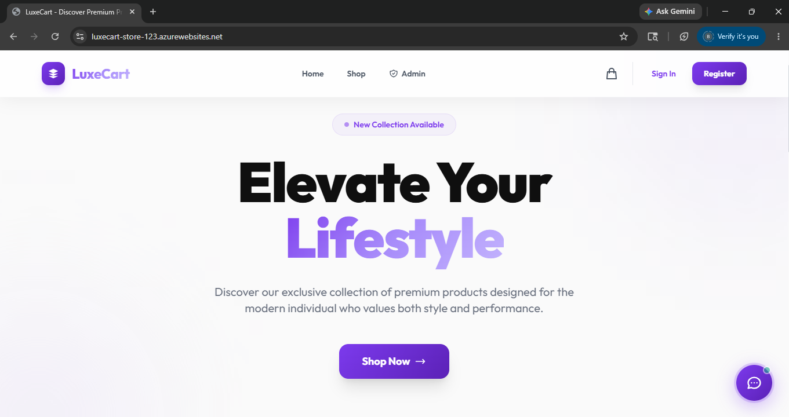
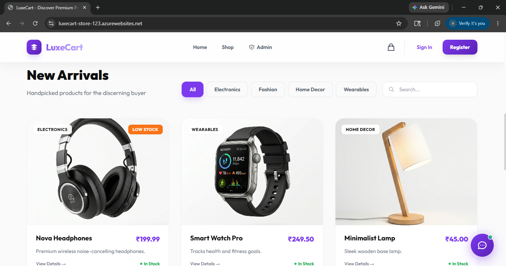
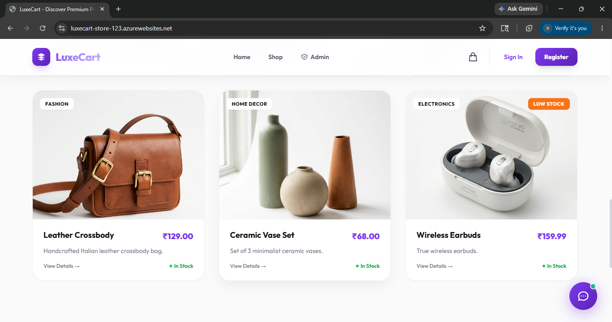
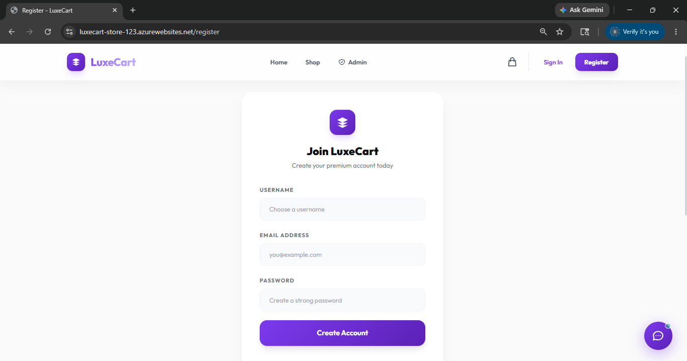
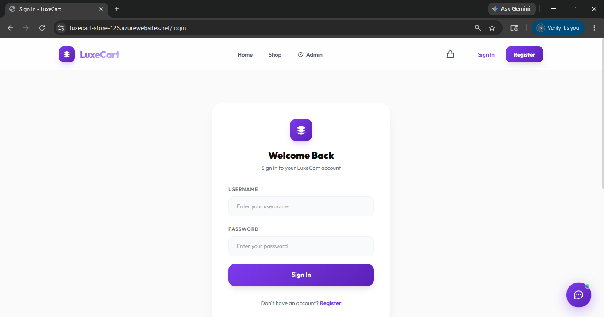
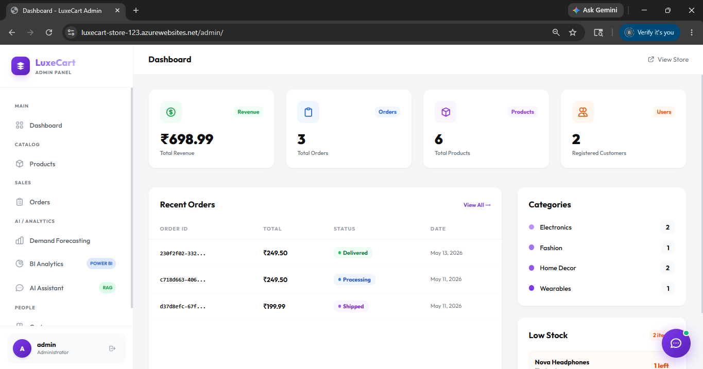
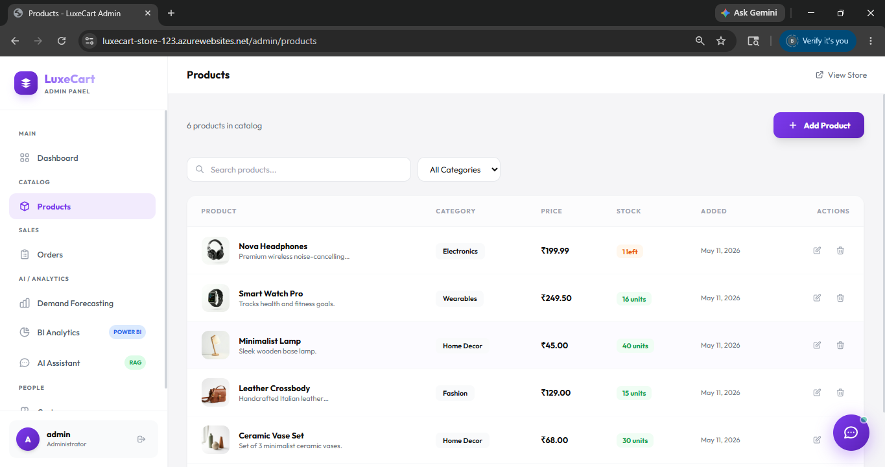
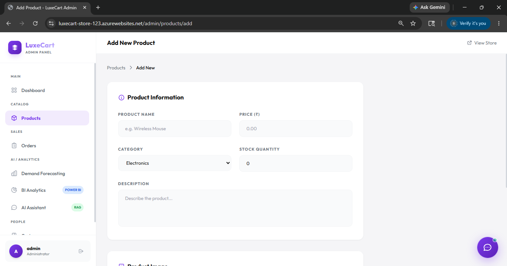
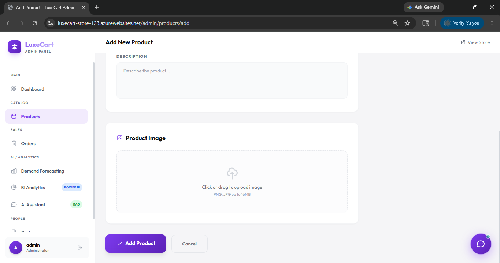
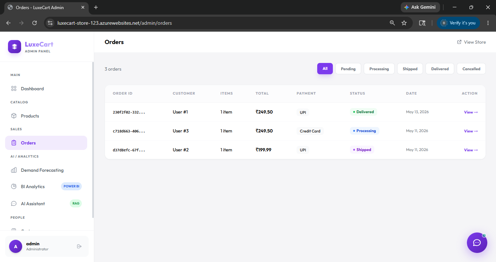
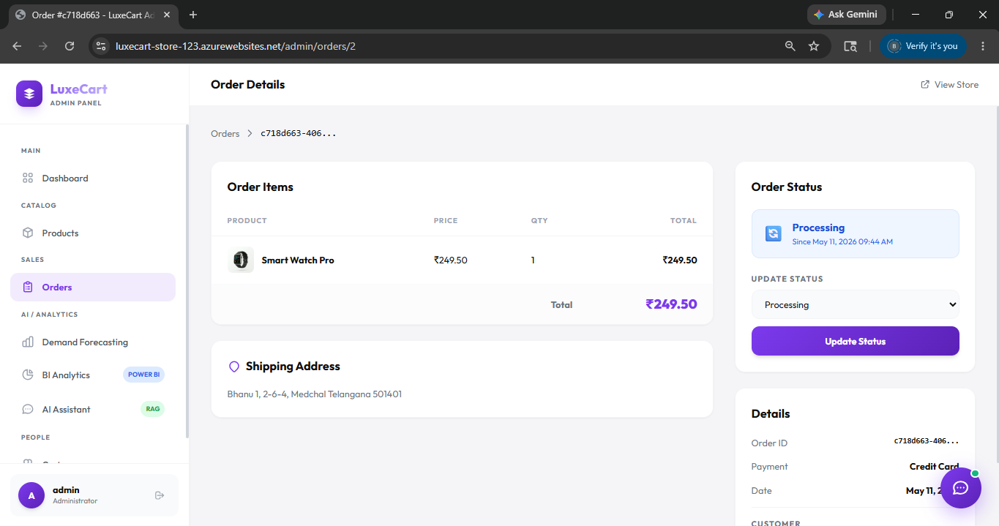
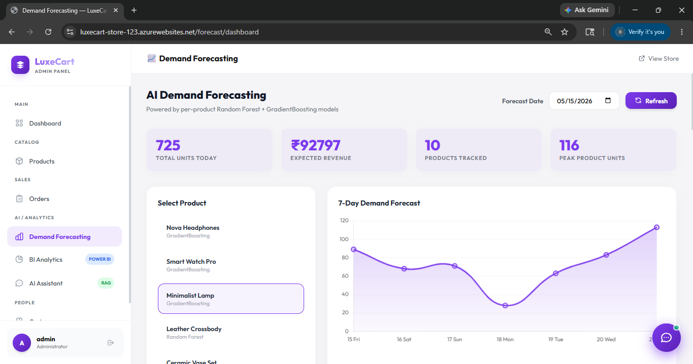
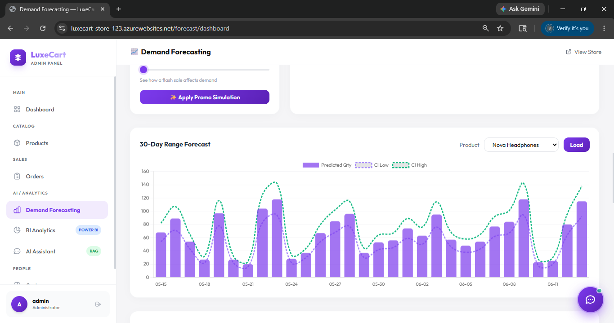
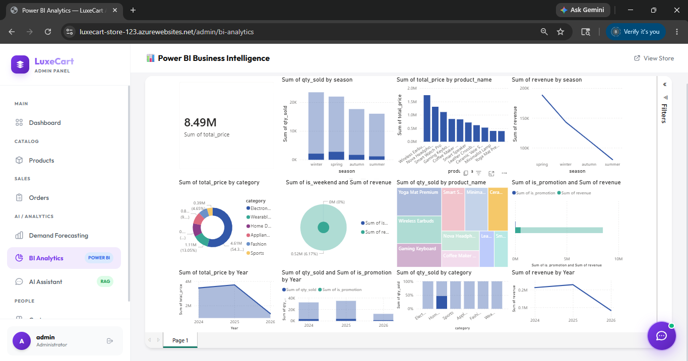
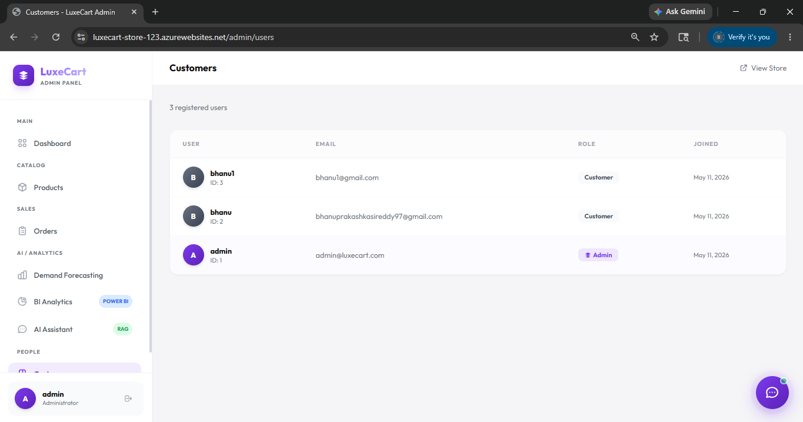
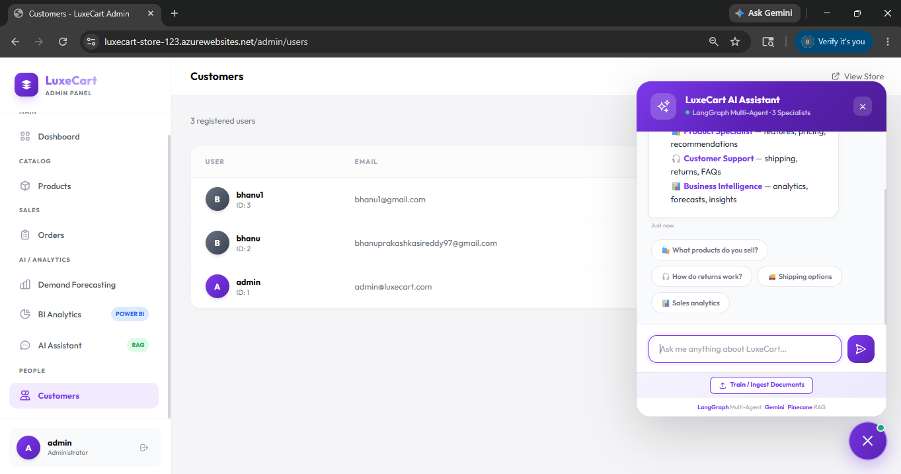
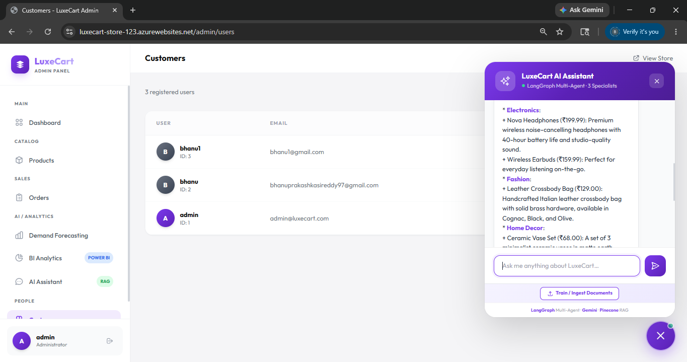
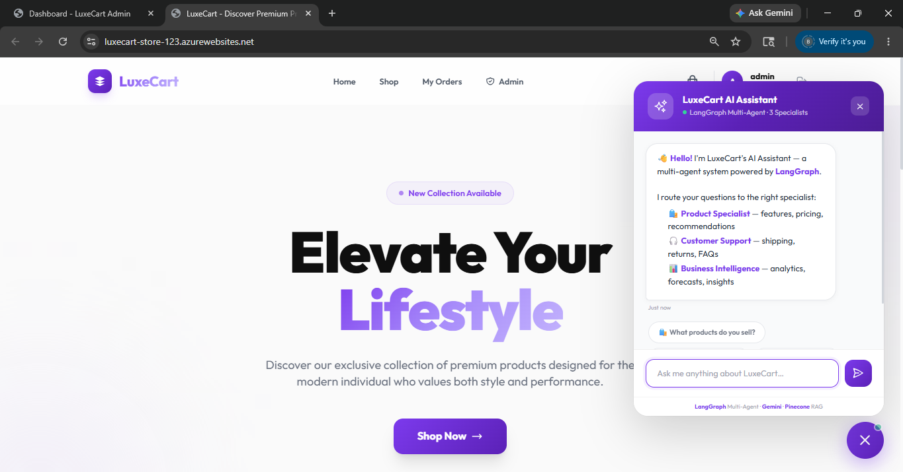
